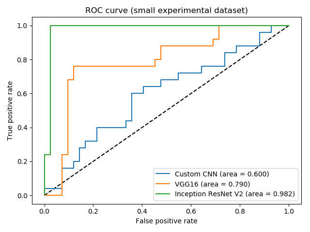
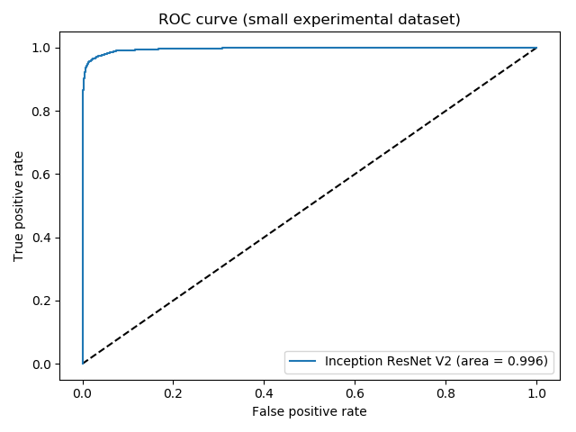

# PigFinder 2000
Image recognition deep learning model to find Miss Piggy and other pigs in an episode of the Muppet show

## Student Data
David Penz, 11703497

Giulio Pace, 11835706

## Entry point of the code

To run the code you need to execute the script ./pigfinder2000.sh as a program
the script takes the path to a video as an argument. mp4 format works for sure, other formats may cause problems sometimes.

There is one test file in the test_episodes folder available for testing.

example:
$ ./pigfinder2000.sh test_episodes/test1.mp4

## Info on architecture
### Image Classification
A very simple and shallow CNN has been implemented to create some kind of baseline evaluation for the other models. This CNN consists of the following layers:
- Input Shape 200x200x3
- 2D Convolution (Kernel Size 3x3)
- ReLU Activation
- 2D MaxPooling (Kernel Size 2x2)
- Flatten Layer as Input for FC Layers
- Dense Layer (Output 128)
- ReLU Activation
- Dense Layer (Output 1)
- Sigmoid Activation

During the research phase of this project, two architectures seemed to perform very well on image classification tasks, the VGG 16 and the Inception ResNet v2. The final version of this project is using the Inception ResNet v2 for image classification of the individual frames.
### Audio Classification
As we wanted to stick to a full Deep Learning Approach for this project, additional research was conducted to find Deep Learning models for audio classification. One of the more common approaches seems to be preprocessing the audio files into a spectrogram (using librosa) and saving the plots as image. Those images are then fed into a Convolutional Neural Network in order to classify them accordingly:
- Input Shape 64x64
- 2D Convolution (Kernel Size 3x3)
- ReLU Activation
- 2D Convolution (Kernel Size 3x3)
- ReLU Activation
- 2D MaxPooling (Kernel Size 2x2)
- Dropout
- 2D Convoluation (Kernel Size 3x3)
- ReLU Activatoin
- 2D Convolution (Kernel Size 3x3)
- ReLU Activation
- 2D MaxPooling (Kernel Size 2x2)
- Dropout
- 2D Convoluation (Kernel Size 3x3)
- ReLU Activatoin
- 2D Convolution (Kernel Size 3x3)
- ReLU Activation
- 2D MaxPooling (Kernel Size 2x2)
- Dropout
- Flatten Layer as Input for FC Layers
- Dense Layer (Output 512)
- ReLU Activation
- Dropout
- Dense Layer (Output 2)
- Softmax Activation

## Performance indicators
To measure the performance of our models, we were using the following metrics:
- Accuracy throughout the training process
- ROC curve using test data
- Human Evaluation by taking a closer look at the results from our model
### Image Classification
The initial baseline was created by using the baseline Image CNN and let it train for 20 epochs on a small dataset. Additionally, a first training round was done with the VGG 16 and Inception ResNet v2 model (2 epochs) to compare their performance with the baseline model.

  
As the Inception ResNet v2 performed the best on first runs using a small dataset, we decided to use it an train it on the whole dataset for the final network of this project. The network was trained for 5 epochs (1.5 days), achieving a training accuracy of 97%.

### Audio Classification
The Audio CNN was trained on the dataset for 100 epochs (0.5 days), unfortunately though, the model did not perform very well and completely overfitted on class 0 (no pigs present). This could be due to poor quality of labelling, unbalanced datasets (more samples of no pigs vs few samples of pigs). Due to its poor performance, the ROC curve also led to an AUC of 0.5.

## Timesheet of Giulio Pace
| Date        | Time    | Description                     									|
|-------------|---------|-------------------------------------------------------------------|
| 2019/10/17  | 13-16h  | attended lecture                									|
| 2019/10/18  | 09-12h  | attended lecture                									|
| 2019/11/15  | 10-12h  | brainstorming & project setup   									|
| 2019/11/16  | 16-17h  | extracted images and audio from files 							|
| 2019/11/17  | 17-21h  | started labelling images		  									|
| 2019/12/04  | 16-18h  | research state of the arts image model and started implementation | 
| 2019/12/14  | 14-17h  | implementation of image model 									| 
| 2019/12/22  | 20-22h  | research state of the art audio model								|
| 2020/01/12  | 11-15h  | completed labelling images and audio 								|
| 2019/01/14  | 16-19h  | research and implementation audio model							|
| 2019/01/17  | 14-16h  | completed audio model 											|
| 2019/01/18  | 12-16h  | Attempts at GUI, settled for a terminal script 					|
| 2019/01/19  | 10-12h  | project finished 													|

## Timesheet of David Penz
| Date        | Time    | Description                     									|
|-------------|---------|-------------------------------------------------------------------|
| 2019/10/17  | 13-16h  | attended lecture                									|
| 2019/10/18  | 09-12h  | attended lecture                									|
| 2019/11/15  | 10-12h  | brainstorming & project setup   									|
| 2019/12/04  | 16-18h  | research state of the arts image model and started implementation | 
| 2019/12/14  | 14-17h  | implementation of image model 									| 
| 2019/12/22  | 20-22h  | research state of the art audio model								|
| 2020/01/12  | 11-15h  | completed labelling images and audio 								|
| 2020/01/13  | 23-24h  | initialisied training of the image model |
| 2019/01/14  | 16-19h  | research and implementation audio model							|
| 2019/01/17  | 14-16h  | completed audio model 											|
| 2019/01/17  | 22-23h  | initialisied training of the audio model |
| 2019/01/18  | 12-16h  | Attempts at GUI, settled for a terminal script 					|
| 2019/01/19  | 10-12h  | project finished 													|

## Hardware Specs
### Computer 1
Ubuntu 18.04.3 LTS 64bit
RAM 13,6 GiB
CPU AMD® Ryzen 5 pro 3500u w/ radeon vega mobile gfx × 8 

### Computer 2
Windows 10 Pro
RAM 8 GB
CPU Intel Core i7-6600 CPU 2.6 GHz

### Computer 3 (Training of Networks)
Windows 10 Pro
RAM 16 GB
CPU Intel Core i7 3.2 GHz
GPU Nvidia GTX 1070
